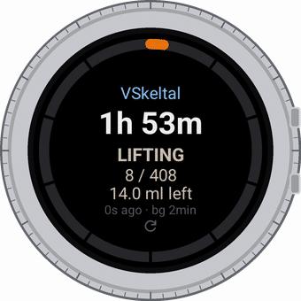

# TinyStatus

A Wear OS app that shows your **[TinyMakerWiFi](https://github.com/slibbinas/TinyMakerWifi)**
3D printer on your wrist and on your watch face.



Time left, current layer, resin left in the vat, and a progress ring. It can
watch the print in the background and buzz your wrist when the print ends or
the resin runs low. The numbers can also live on your watch face as
complications, so you see them without opening anything.

Install and usage: **[INSTALL.md](INSTALL.md)** · Downloads:
[Releases](https://github.com/slibbinas/TinyStatus/releases)

## Why this repository exists

Until 2026-09-10 the code lived in the watch face repository and the releases
were published under `TinyMakerWifi`. Both were temporary and both got in the
way: a watch face has nothing to do with a printer, and `TinyMakerWifi` is a
PlatformIO project where an Android toolchain would pollute the firmware CI,
leaving the releases with no source of their own.

The history moved with the code (`git subtree split`), so the reasoning behind
each decision came along - and in this project that reasoning is most of the
value.

## Things worth knowing before reading the code

**The printer does not announce the end of a print.** `/api/status` simply stops
reporting `busy` and `model` goes empty. The app **derives** the ending itself by
comparing two consecutive polls, which is why there is a whole state machine in
`TsPranesimas.java` rather than an event handler.

**The API reports no percentage** - progress is computed from layer counts.

**Complications never touch the network.** The system asks providers every time
you raise your wrist; if they fetched, every wrist-raise would become a Wi-Fi
radio wake-up. They answer from cache, and freshness comes from the background
watcher.

**Row widths on screen are computed from the circle equation**, not chosen by
eye - otherwise text slides under the progress ring on a round display.

## Layout

| | |
|---|---|
| `src/.../TsSaltinis.java` | printer list, fetching, cache, network choice |
| `src/.../TsBusena.java` | `/api/status` fields and what they mean |
| `src/.../TsPranesimas.java` | state machine; the only writer of notifications |
| `src/.../TsSargas.java` | background watcher (foreground service + exact alarms) |
| `src/.../TsKompl.java` | four complication data sources |
| `src/.../TsAtnaujink.java` | checks GitHub for a newer release, installs it when you tap Update |
| `MainActivity.java` | screen, gestures, settings windows |
| `build.sh` | builds a signed APK **without Gradle** |
| `ikonos.py` | icons (Material Symbols, Apache 2.0) |
| `dokumentas.py` | builds the GIF from real watch screenshots |

## Building

```bash
bash build.sh
```

Needs a JDK and Android build-tools; **no Gradle**. On the first run it
downloads one 700 KB Google library (`wearable:2.9.0`) - the complication
provider base class lives there - and keeps it in `libs/`, which is not in git.

The signing key is not in git either. It defaults to
`../keystore/vdigi.keystore` and can be pointed elsewhere with `WEAR_KEYSTORE`.
**Do not change the key:** an APK signed with a different one cannot be
installed over an existing copy.

## Notes on language

Code comments and the working notes in `CLAUDE.md` are in Lithuanian - that is
the maintainer's working language. Everything a user reads (this file,
`INSTALL.md`, release notes, and the app itself) is in English.
